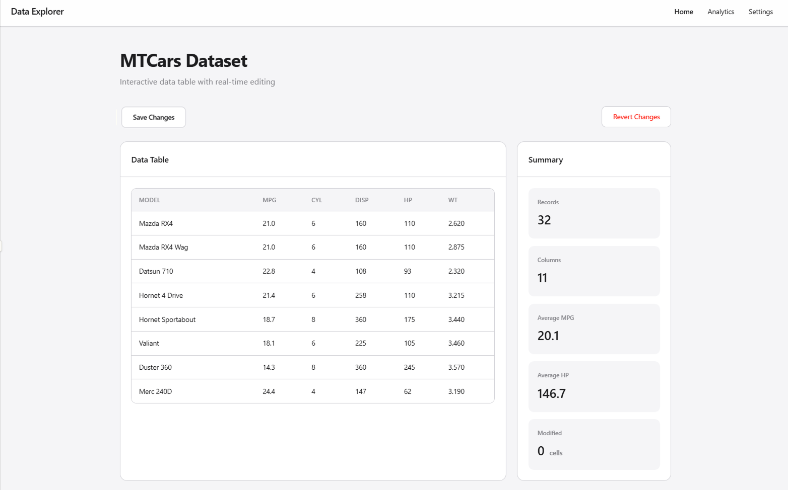

# 📦 atorus.takehome — Candidate Take-Home Assignment

## Welcome! This assignment evaluates your ability to work with:

- Shiny modules
- R6 classes for state & backend data management
- DuckDB + DBI
- Custom htmlwidgets (editable table)
- Golem application structure

Your goal is to complete a small but functional Shiny application following the scaffold provided.

## 🎯 Your Objective

You must build a working Shiny app that:

- Loads data from a bundled DuckDB database into a DataStore R6 object.
- Passes the DataStore instance into a Shiny module responsible for rendering and editing the data table.
- Uses a custom htmlwidget to display and edit the table.
- Allows the user to revert changes.
- Displays a summary of the dataset.
- Implements a minimal UI consistent with the wireframe.

The app architecture looks like this:

```
app_server()
  └── store <- DataStore$new()
  └── mod_table_server("table", store)

📁 Repository Structure
R/
  ├── app_server.R
  ├── app_ui.R
  ├── DataStore.R          # R6 class (incomplete–you implement)
  ├── mod_table.R          # Shiny module wrapping the htmlwidget
inst/
  ├── extdata/
  │   └── mtcars.duckdb    # You will connect to this
  └── htmlwidgets/
      ├── hotwidget.js
      ├── hotwidget.yaml
      └── hotwidget.css
www/
  └── wireframe.png
```

## 🧩 Core Tasks
✅ Task 1: Complete the R6 DataStore

File: R/DataStore.R

Implement the following in initialize():

Locate bundled database

`system.file("extdata", "mtcars.duckdb", package = "atorus.takehome")`

Connect to DuckDB

Load the mtcars table

Store the data in:

```
self$data
self$original
```

Implement the behavior of:

- `update_cell(row, col, value)`
- `revert()`
- `summary()`

**Important:**
The DataStore object is created once in the main app and passed into the table module.

✅ Task 2: Implement the Table Module

File: R/mod_table.R

The module must return a UI with only the widget output, 
and output the table and data back to the main server

### Candidate responsibilities for the module:

- Understand how an R6 object is passed into a module
- Manage all widget I/O inside the module
- Ensure the table rerenders when store data changes
- Trigger updates back into the store using the custom htmlwidget

## ✅ Task 3: Implement the htmlwidget

Files:

- inst/htmlwidgets/hotwidget.js
- inst/htmlwidgets/hotwidget.css

R/mod_table.R (widget wrappers)

Required from you:

- Render the table in JS

Capture cell edits

- Send edits to Shiny:
- Handle table rerendering when R sends updated data

## ✅ Task 4: Build the main Shiny application

Follow the provided wireframe:



# 🧪 Expected Application Behavior

- Data loads from DuckDB on app start (or via a button).
- Table module displays data using the custom widget.
- Editing a cell updates the store.
- Reverting resets the store and rerenders the table.
- Summary reflects the current dataset.
- All state lives in the DataStore R6 object.

## 🚀 Optional Enhancements (Bonus)

Not required, but appreciated:

- Save-back-to-DuckDB functionality
- Inline validation in the table
- Column type formatting
- Sorting / filtering

## 📤 Submission

Please send back:

- The working package or app folder
- Anything extra you'd like us to review

## 🎉 Good Luck!

We’re excited to see your implementation.
